# POST/CON 2019 - Testing, Automation and Reporting Workshop


This repo contains a set of links and resources used during the POST/CON 2019 _Testing, Automation and Reporting_ Workshop, presented by Trent McCann and Danny Dainton. The `PDF` file of the slide deck for the workshop can also be found in the `Assets` directory.

## Collection Import Links

For this workshop we will be using the following Collections, these will need to be imported into your local Postman app. This can be done by either cloning the repo and importing the `Collections` folder from the `Assets` directory or using the sharable URL Links to the Collections below.

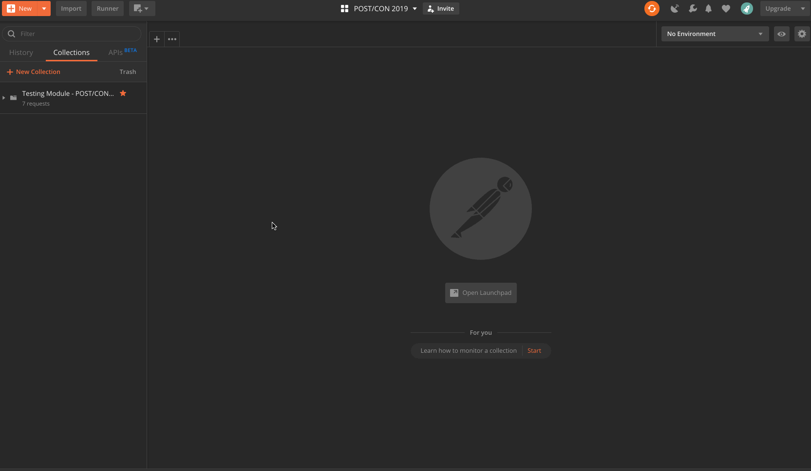

- Select `Import`
- Select the `Import From Link` tab
- Paste `URL` into the text field
- Press the `Import` button

### Advanced Testing Techniques Collection

Use either this link: https://www.getpostman.com/collections/c76ac4f0a446524b9708 or this link: http://bit.ly/advtestingcollection

### Collection Runner Demo Collection

Use either this link: https://www.getpostman.com/collections/24473d1926b7ff9a8567 or this link: http://bit.ly/runnerdemo

These links have been created straight from the Postman application and provide an easy way to share your collections with other Postman users. They can be either directly imported or used to run the Collection from the command line with Newman.

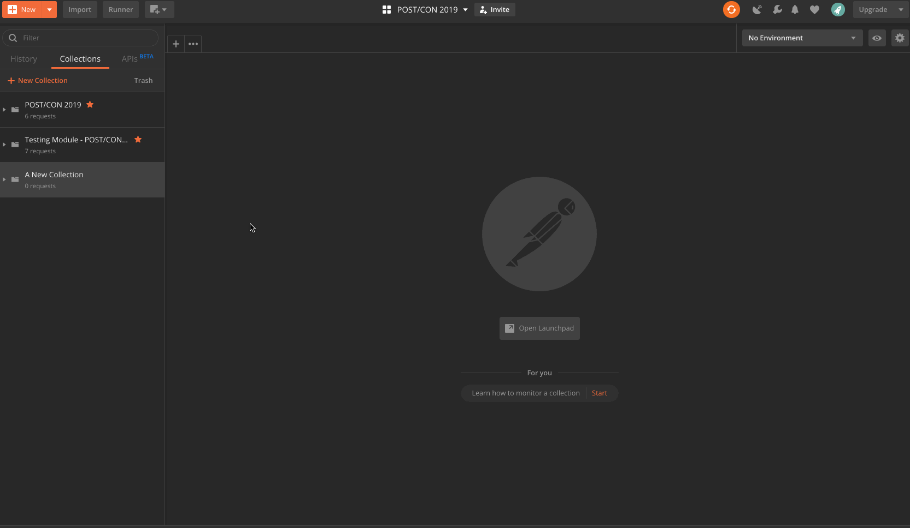

- Select the `>` option from the Collection name in the sidebar
- Select `Share`
- Select the `Get Link` tab
- Select the `Get Link` button to create the new URL link

---

## Advanced Testing

This section of the workshop will concentrate on exposing some of the more _Advanced_ features available for you to use in the `Pre-Request Scripts` and `Tests` tabs. Some of these features might already be familiar to you but hopefully, we're going to be using these in a different way than you're used too. Some of them might be brand new and give you some insights into how this _could_ be used in your context.

The `Testing Module - POST/CON 2019` Collection that you imported contains a series of `examples` where we will be showing you how some of the Postman features can be used within a request. These examples are designed to be simple and not a _complete_ use case solution, it's more about the expose of the lesser-known features and describing the different ways in which they could be used.

Before breaking down the features, I want to highlight the importance of this document on our learning centre - [API Sandbox Reference](https://learning.getpostman.com/docs/postman/scripts/postman_sandbox_api_reference/), It's such an important page to have as a reference guide when doing anything in the Sandbox environment. It gives you tons of functions available and where they can be used - Well worth getting not only familiar with but also bookmarking as I know it's something that I continue to come back to all the time.

Let's look at the different examples in the `Testing Module - POST/CON 2019` Collection.

#### Example One

For many versions `Dynamic Variables` have been part of the Postman app, these have been extremely valuable when needing to create random data in a different area of the application. However, if you ever needed something other than a random `Int`, `timestamp` or `guid` you would need to either hardcode these values or create some JS code in the Sandbox.

Now that's a thing of the past with the introduction of the random fake data variables into the application. A subset of the awesome [FakerJS](https://github.com/marak/Faker.js/) module has been added to allow you to create different random data sets in your request.

In the first example, we are using these random fake data variables, a list of these can be [found here](https://learning.getpostman.com/docs/postman/scripts/postman_sandbox_api_reference/#dynamic-variables). In the first `POST` request, we are using these in the `params`, `headers` and `body`. They are returned in the response results from the Postman Echo API.

```json
{
    "contacts": [
        {
            "name": "{{$randomFullName}}",
            "jobTitle": "{{$randomJobTitle}}",
            "companyName": "{{$randomCompanyName}}"
        },
        {
            "name": "{{$randomFullName}}",
            "jobTitle": "{{$randomJobTitle}}",
            "companyName": "{{$randomCompanyName}}"
        },
        {
            "name": "{{$randomFullName}}",
            "jobTitle": "{{$randomJobTitle}}",
            "companyName": "{{$randomCompanyName}}"
        }
    ]
}
```

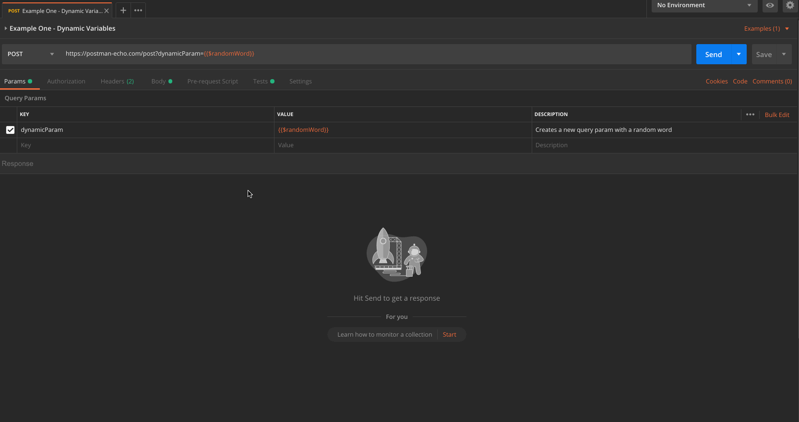

As well as the random variables set and used in the request, we can see in the .gif that Two tests have been run. These have been located at the collection level, by moving them up to that level rather than in the request, they are run for each of the requests in the Collection. Reducing the need to repeat them in each of the Collection requests.

#### Example Two

For the second example, this is similar to the first but this is showing that not only can the faker data variables be used in a single request, these can also be added to an `example` response that can be used with the `Mock Server` in the Postman application. More information about Mock Servers can be [found here](https://learning.getpostman.com/docs/postman/mock_servers/intro_to_mock_servers).

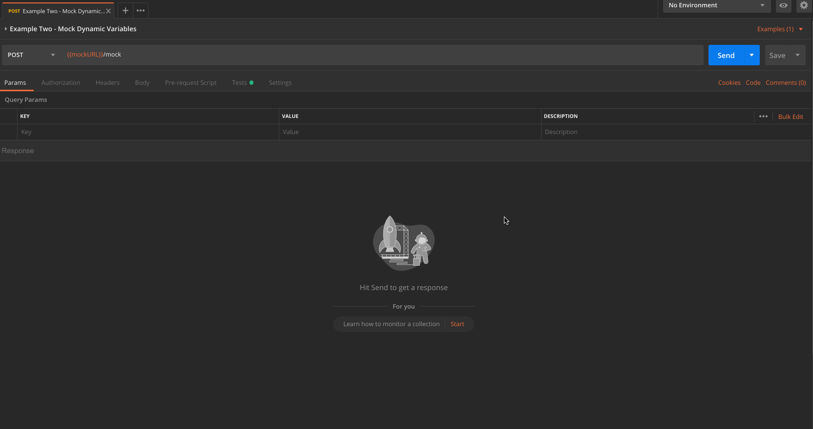

#### Example Three

In this example, we will be taking a look at some of the tests that you can create to check for certain higher-level items that relate to the whole request. We have covered the `Status Code` and the `Response Time` checks at the start of the workshop but these only really just give you a very focussed level of confidence in your API endpoints. Postman provides some out of the box methods available to you via the `pm.*` API in the Sandbox, these can provide you with a quick set of higher-level checks that can alert you to issues in the API quicker.

One of these is the `.to.have.header` which will allow you to check for certain response headers that you feel are important, maybe you have a custom header that you use and you want to ensure this is correct and showing the correct value. More information about all the other functions that you can use, can be [found here](https://learning.getpostman.com/docs/postman/scripts/postman_sandbox_api_reference/#response-assertion-api-available-in-the-test-scripts).

```javascript
// Check that the response contains the correct headers
pm.test("The Content-Type header is returned in the response", () => {
    pm.response.to.have.header("Content-Type");
});

// Check that the response header is the correct value
pm.test("The Content-Type header has the correct value", () => {
    pm.response.to.have.header("Content-Type", "application/json; charset=utf-8");
});
```

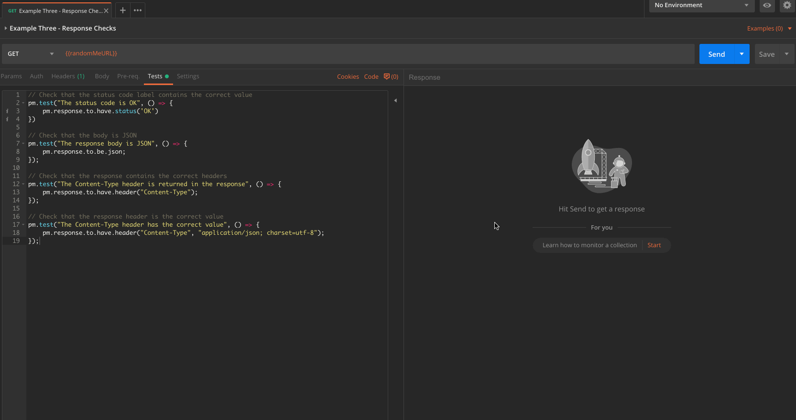

The .gif shows the header check as well as the other assertions listed running against the endpoint response. Once added to the Collection, these will be run every time, if something has changed, you will be alerted straight away.

#### Example Four

At the start of the workshop we covered using some of the `Test Snippets` available to you, these cover some of the more general tests and don't account for your context. Using the [ChaiJS](https://www.chaijs.com/api/bdd/) assertion library allows you to create much better assertion in a very readable way.

Example Four covers more of the different tests that you can create, using ChaiJS to check for different details about the actual response data. These checks can check for anything that is a concern or a risk to you. You will be able to use the ChaiJS functions to check that the correct `keys` are present in the response, the correct data type (string, boolean, object, array, number) are being used, check that values contain `oneOf` a certain value.

A test could be created like this to check that the values for the `first` and `last` names are being used in the `email` value. These types of tests are answering questions that you already know and by allowing Postman to run these each time, it's freeing you up to explore the endpoint for the _unknowns_.

```javascript
// Taking data from one part of the response and using it to assert against another value
pm.test("The email address should contain the correct name", () => {
    jsonData.results.forEach(result => {

        // Set the values of the first and last name as a local variable
        let firstName = result.name.first;
        let lastName  = result.name.last;

        // Check that the created email address contains the full name
        // Using .replace() to removed the whitespace in the name eg. marco de silva = marko.desilva
        pm.expect(result.email).to.equal(`${firstName.replace(" ", "")}.${lastName.replace(" ", "")}@example.com`);
    });
});
```

Another example of the tests that you _could_ create are things that check an `object` for various scenarios. For instance, it is an `object` that contains certain `keys`. Checking that the different properties are the correct data types and are not `empty`, `null` or `undefined`. Finally, check to see that the correct `datetime` format is being returned in the response.

```javascript
// Testing multiple different scenarios for the `dob` object
pm.test("The `dob` object should contain the correct data", () => {
    jsonData.results.forEach(result => {
        // Check that `dob` is an object with the specified keys
        pm.expect(result.dob).to.be.a('object').and.have.keys('date', 'age');

        // Check that `date` has the correct data type
        pm.expect(result.dob.date).to.be.a('string');

        // Check that the values are not empty, null or undefined
        pm.expect(result.dob.date).to.not.be.empty;
        pm.expect(result.dob.date).to.not.be.null;
        pm.expect(result.dob.date).to.not.be.undefined;

        // Check that the date format is correct using .match()
        pm.expect(result.dob.date).to.match(/^\d{4}-\d{2}-\d{2}T\d{2}:\d{2}:\d{2}Z$/);

        // Check that `age` has the correct data type and is below 100
        pm.expect(result.dob.age).to.be.a('number').and.be.below(100);

        // Check that the values is not null or undefined
        pm.expect(result.dob.age).to.not.be.null;
        pm.expect(result.dob.age).to.not.be.undefined;
    });
});
```

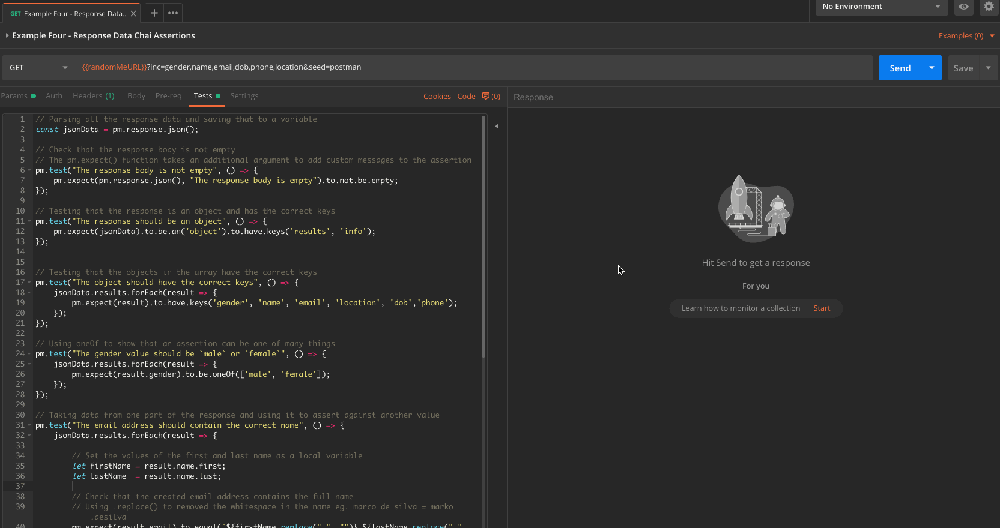

In the .gif you can see the two tests above and the additional assertions using the different ChaiJS functions, running against the response. These are covering several different things in the response data and will continue to check for the same thing each time the `Send` button is pressed.

#### Example Five

In this example, we will be looking at a couple of the built-in modules that come with the Postman app. There are a few different utility type modules that extract the pain away from creating custom JS code in the Sandbox environment to achieve the same thing.

We're going to look at 2 modules [Lodash](https://lodash.com/docs/) and [Moment](https://momentjs.com/docs/), if you have worked with Node projects in the past, these 2 modules are going to be familiar to you. Lodash contains lots of different helpers that allow you to do several different things, that's quite a vague sentence but there are far too many functions available to cover each one in a scenario.

I'm going to use a couple of these in the `Pre-request Script` and `Tests` to just show you a couple of the ways they _can_ be used to create and assert against the response data. As well as Lodash, we have the `Moment` module that deals with all things time. Again, this a very powerful module with lots of cool features but I'm only going to be using one here to show you a simple use case.

```json
{
    "users": [
        {
            "firstName": "joe",
            "lastName": "bloggs",
            "favoriteNumber": "{{favoriteNumber}}",
            "favoriteColours": "{{favoriteColours}}",
            "todaysFavoriteColour": "{{todaysFavoriteColour}}",
            "uniqueAnimals": "{{uniqueAnimals}}"
        }
    ]
}
```
I'm only going to be using a couple of the Lodash functions for the example but hopefully, these give you an idea how to these or any other ones. This is just something simple using the `_.uniq()` function and this will reduce an array of items, in this case, a list of Animals and create a new array without the unique values. This is very basic and in some cases not at all relevant to your context but it's giving you more of a feel of the things that you _could_ use when creating your test suites.

```javascript
// Using the _.uniq() function to create a new array within the replicated values
let uniqueAnimals = ["Dog", "Cat", "Dog", "Cow", "Dog", "Lion", "Dog", "Horse"];

pm.globals.set("uniqueAnimals", _.uniq(uniqueAnimals));
```

Using the `Moment` module is slightly different, you need to `require()` the module and set this to a variable, once set, you're free to use this in the Sandbox. For this example, we're setting a couple of new `global` variables and these are going to be using in the params of our request. What we're going to do is set a timestamp using a particular format _"DD/MM/YYYY"_ as our `startDate` then using the `.add()` function, we're going to create an `endDate` with the same format but this time we are going to add _30 days_ to the date.

```javascript
// Bringing in the moment module
var moment = require('moment');

// Creating a variable to use as the start date in a particular format
pm.globals.set("startDate", moment().format("DD/MM/YYYY"));

// Creating a variable to use as the end date and using the .add() function to set it 30 days in the future
pm.globals.set("endDate", moment().add(30,'days').format("DD/MM/YYYY"));
```

The .gif shows you the `Request Body` and the different scripts in the Sandbox environment. Once the request is sent, the data is created as variables and is used in the `POST` body. There is also a very basic test include to show that data from the response can even be manipulated using the Lodash functions, in this case, it's just capitalizing the first letter of the name.   

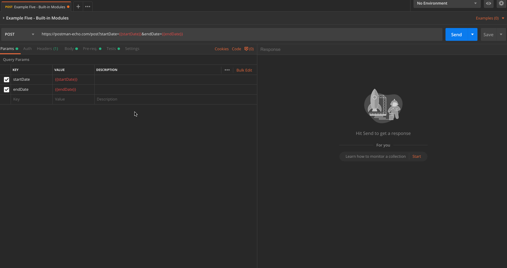

#### Example Six

This example is to show you some of the Power that the Postman console can provide you, this on it's only will give you information about the Request and Request but coupled with the `console.log()` statement can help debug and also set up tests, allowing you to check the results before adding any assertions to them.

If you have used the `console.log()` statements in a browsers Dev Tools, you're going to pick this up and start using this to its full potential straight away.

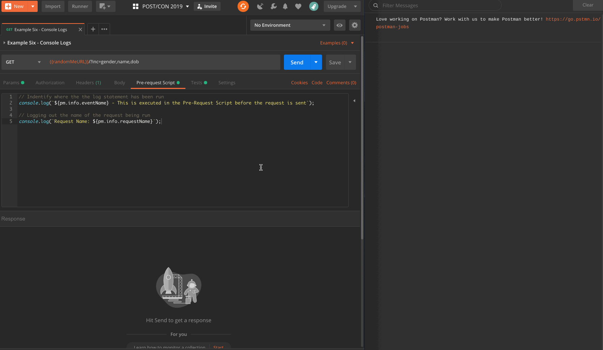

#### Example Seven

This final example is a basic introduction to Schema validations, this is a workshop in itself but if done correctly these validations can cover many of the individual test scenarios, all at the same time. Postman comes with the built-in [Ajv](https://github.com/epoberezkin/ajv) module which allows you to do some very complex checks on the data being returned in the response.

```javascript
var Ajv = require('ajv'),
    // Using the Ajv options
    ajv = new Ajv({logger: console, allErrors: true, verbose: true}),
    // Getting the schema that has been saved as a collection level variable - This has been added to the description for easy viewing
    schema = JSON.parse(pm.variables.get("schema"));

// Validate the Schema against the response body
pm.test('Schema is valid', () => {
    pm.expect(ajv.validate(schema, pm.response.json()), JSON.stringify(ajv.errors)).to.be.true;
});
```

This .gif shows you the schema validation in action, the test code above is only a single part of it though. The actually `schema` is set to a Collection level variable and the test code is setting that and using it in the assertion. In the .gif, you can see the schema has been added to the description of the request so that it can be read easily and the different parts of the schema can be checked off against the response.


#### Various Links around API Testing

- https://qagoose.com/2018/10/31/what-is-api-testing/
- https://www.danieldonbavand.com/testing-speedloads-api-mnemonic/
- http://testingisbelieving.blogspot.com/2013/11/johnny-mnemonic-iceovermad.html
- https://club.ministryoftesting.com/c/30-days-of-testing/30-days-of-api-testing
- http://thethinkingtester.blogspot.com/2019/07/one-request-sixteen-assertions.html
- http://katrinatester.blogspot.com/2015/09/api-web-services-microservices-testing.html
- https://dev.to/dohertykornelia/all-you-need-to-know-about-api-testing--2ck9
- https://dev.to/kaustavdm/continuous-testing-of-apis-3e5f
- https://leanpub.com/testrestapi
- https://www.youtube.com/playlist?list=PL6iUkDSEH9SvsgM4zyFrTnaewN65NZHAG

## Automated Testing

This section of the workshop will cover your first steps into Automating the Collections that you have been running on a request per request basis. First, we'll show you how you can run the very basic `POST/CON 2019` Collection, that you imported earlier, through the Built-In Collection Runner.

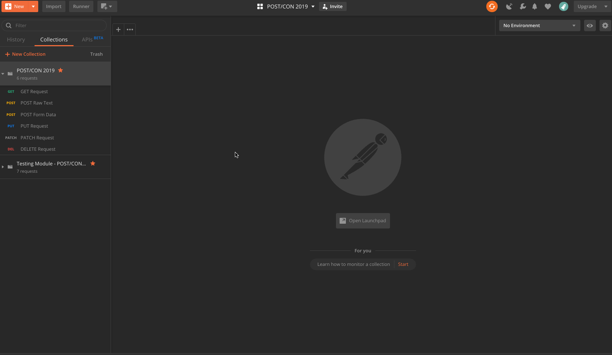

- Select the `>` option from the Collection name in the sidebar
- Select `Run` and this will open the Collection Runner
- Select the blue `Run POST/CON 20...` button

This will run the selected `Collection` and the requests listed within it, as there are only 6 requests, this will be super quick. Only the `Run Results` window you will see all the information about the run. From here, you can drill down into each of the requests by selecting the request name and expose details like the `Request URL, Headers, Body` and the `Request Headers, Body`. Also, you can see any `Tests` that have been run and the Pass/Fail results of these.

Running Collections from the Built-In Runner is an easy way to add some much-needed automation into your process. However, this is still a semi-manual task and this is where [Newman](https://github.com/postmanlabs/newman) comes into play. Newman is the Postman command-line companion, this will give you the power to run the Collections straight from the command line and eliminating the need to drive these from the Postman UI.

Newman is a [NodeJS](https://nodejs.org/en/) package that can be installed globally onto your local machine using the following command:

`npm install -g newman`

Once installed, the Collections can be either run from the command line using an `Exported` JSON file or using the sharable URL link (This process can be seen above).

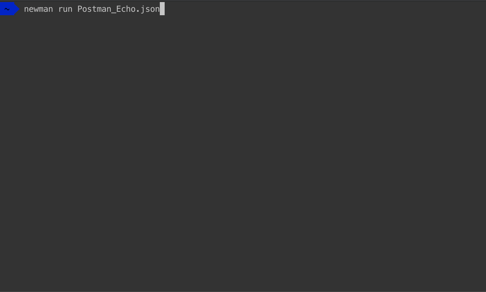

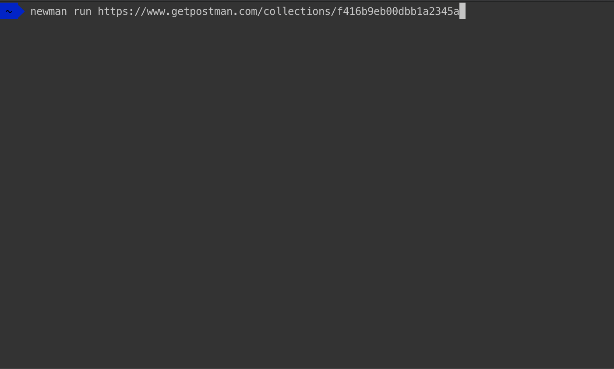

This is an example of running Newman in the most the basic case, the module comes with several different command-line options that can allow you to pass in different arguments and run the Collection with `environment` or `global` variable files are well as different `data` files and variations of the number of iterations etc.

To list the full cli options available, just run the following command:

`newman run -h`

Newman also has a [Docker image](https://hub.docker.com/r/postman/newman/) this provides an easier way to run Collections via Newman, without needing to have NodeJS installed on your local machines.

If you have Docker installed, running a basic Collection is as easy as running the following command:

`docker run -t postman/newman run "https://www.getpostman.com/collections/8a0c9bc08f062d12dcda"`

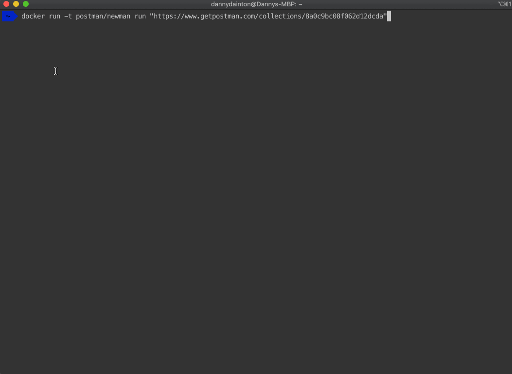

Running Collections from your local machines using Newman is a first step into integrating these into your build process, ideally, you would want these Collections running when a new commit is made or on some sort of timed run to highlight/alert you to any new changes in the code, that cause previous tests to fail.

One method of doing this is to hook these up to [Jenkins](https://jenkins.io/) - We will cover a few different methods of doing this and running a Collection through Jenkins and viewing the output.

A similar method of doing this can be [found here](https://www.youtube.com/watch?v=7ar4-O3vNiM) over on Valentin Despa's YouTube channel.

As well as running these Collections with Newman via Jenkins, this _could_ also be hooked up to several other CI systems including TravisCI, CircleCI, GitLab and BitBucket.

A repo containing some of the different ways with demo examples and the `.yml` files needed can be [found here](https://github.com/DannyDainton/postman-ci-pipeline-example).

## Reporting

This section of the workshop will be covering the different Reporting options available to you, when using Newman do run your Collections. In a number of the demos, you would have seen the CLI reporter output from Newman. This is the default reporter that comes out of the box and contains several configuration options to allow you to display the output in many different ways. All the options can be [found here](https://github.com/postmanlabs/newman#cli-reporter).

A couple of other _out of the box_ reporters are also available for you to use with the Newman, these include JSON, JUNIT, Progress and Emojitrain. These give you a different output depending on your needs. They can be specified using the `-r <reporter name>` command.

`newman run https://www.getpostman.com/collections/24473d1926b7ff9a8567 -r progress`

To use more than one reporter, just simply add a comma and the name of the reporter:

`newman run https://www.getpostman.com/collections/24473d1926b7ff9a8567 -r cli,progress,junit`

Newman was designed to be extendable, you can use Newman as a library within a NodeJS app and expand this out to do things like creating a slack bot to run your Collections using a custom slash command - More details of that can be [found here](https://github.com/DannyDainton/basic-newman-slack-bot).

The reporting aspect of Newman can also be extended to allow for the creation of new reporters. These cover different use cases and is _generally_ driven from the efforts of the Postman community.

Some boilerplate code is all you need to get going, as long as the reporter follows the same naming convention `newman-reporter-<name>`, then this will be picked up be Newman when used in the `-r <reporter name>` command.

```javascript
function CustomNewmanReporter (emitter, reporterOptions, collectionRunOptions) {
  // emitter is an event emitter that triggers the following events: https://github.com/postmanlabs/newman#newmanrunevents
  // reporterOptions is an object of the reporter specific options. See usage examples below for more details.
  // collectionRunOptions is an object of all the collection run options: https://github.com/postmanlabs/newman#newmanrunoptions-object--callback-function--run-eventemitter
}
module.exports = CustomNewmanReporter
```

For example, creating an `index.js` file with something like this could be used with Newman. Not something that's actually going to do anything but it would use the reporter code to output the string. You would only need to use `-r BoilerPlateReporter --reporter-BoilerPlateReporter-word "Postman Is Awesome"` in the `newman run` command, to see the result.

```javascript
function BoilerPlateReporter (newman, reporterOptions) {

    newman.on('done', function () {
        console.log(`You can pass in words like: ${reporterOptions.word}`)
    })

}

export BoilerPlateReporter;
```

More information about the creation of reporters can be [found here](https://github.com/postmanlabs/newman#creating-your-own-reporter). This also lists all the `.on()` functions that hold all the Collection run data.

All the current reporter packages available can be found on [NPM](https://www.npmjs.com/search?q=newman-reporter), as these all need to follow the same naming convention, these are very easy to find. The packages cover options for `CSV`, `StatsD`, `Teamcity`, `Confluence` and many more. Currently, there are around 87 different packages.

A couple of the packages are HTML reporters, Postman created a [HTML Reporter](https://www.npmjs.com/package/newman-reporter-html) that came with Newman but this was extracted out into its own package. An example of what this looks like can be [found here](http://bit.ly/newmanhtml). By extracting this out into its own package, it allows community members to create forks of the project and extend out the information. This uncovers the Collection details that were previously missing and display these in a less 1-dimensional page view. The [HTMLEXTRA Reporter](https://www.npmjs.com/package/newman-reporter-htmlextra) is a different take on the original HTML reporter and a live demo of this can be [found here](http://bit.ly/newmanhtmlextra).

Both of these packages, as well as all the others,  can be installed via NPM using the following command:

`npm install -g newman-reporter-<reporter name>`

---

If you have any questions about the workshop or its content, please do reach out to us at the following places:

#### Contact Us

Trent McCann
- LinkedIn: ca/linkedin.com/in/trentmccann
- Twitter: @Postman_Trent

Danny Dainton
- LinkedIn: uk/linkedin.com/in/dannydainton
- Twitter: @DannyDainton

A better way to continue the conversation and ask all of your questions would be over on our [Postman Community](https://community.getpostman.com) site, Trent and Danny are always on hand to help out with anything Postman related!!
