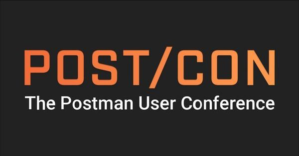

# POST/CON 2019 Workshop

This repo contains a set of links and resources used during the POST/CON 2019 _Testing, Automation and Reporting_ Workshop.

## Collection Import Links

Advanced Testing Techniques Collection:

https://www.getpostman.com/collections/c76ac4f0a446524b9708 or http://bit.ly/advtestingcollection

Collection Runner Demo Collection:

https://www.getpostman.com/collections/24473d1926b7ff9a8567 or http://bit.ly/runnerdemo

---

### Advanced Testing Resources

- [API Sandbox Reference](https://learning.getpostman.com/docs/postman/scripts/postman_sandbox_api_reference/)
- [ChaiJS](https://www.chaijs.com/api/bdd/)
- [Lodash](https://lodash.com/docs/)
- [Moment](https://momentjs.com/docs/)
- [Console Log](https://developer.mozilla.org/en-US/docs/Web/API/Console/log)

### Automated Testing Resources

- [Newman](https://github.com/postmanlabs/newman)
- [Jenkins](https://jenkins.io/)

### Reporting Resources

- [Reporter packages on NPM](https://www.npmjs.com/search?q=newman-reporter)
- [HTML Reporter](https://www.npmjs.com/package/newman-reporter-html)
- [HTMLEXTRA Reporter](https://www.npmjs.com/package/newman-reporter-htmlextra)
